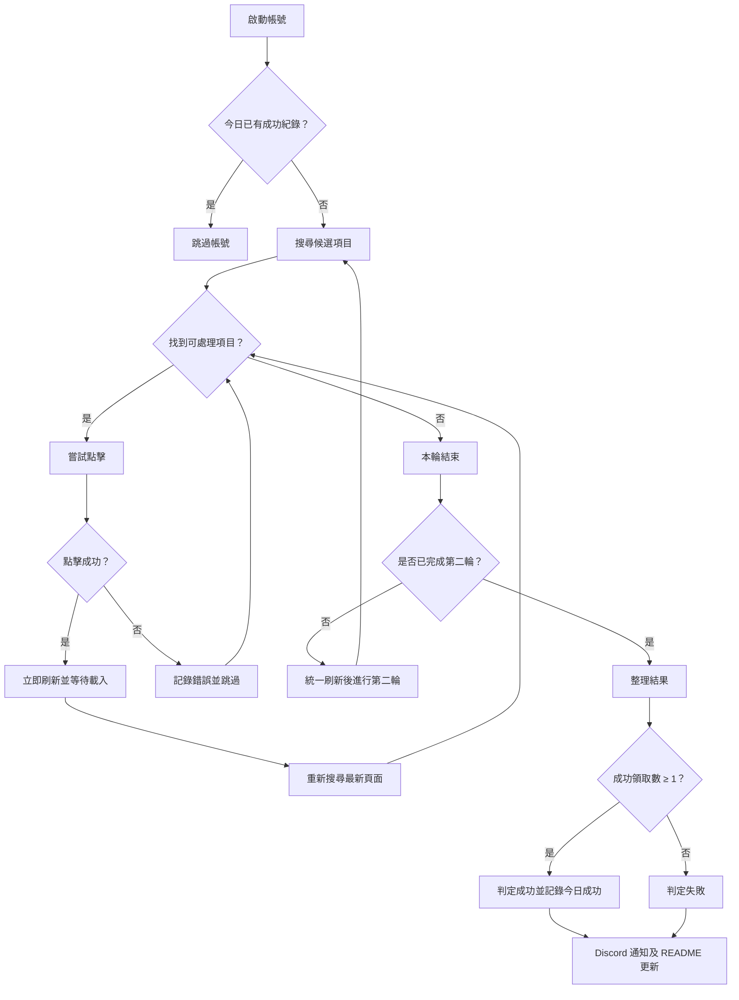

# 自動領取流程圖

```mermaid
flowchart TD
    A["啟動帳號"] --> B{"今日已有成功紀錄？"}
    B -- 是 --> C["跳過帳號"]
    B -- 否 --> D["搜尋候選項目"]
    D --> E{"找到可處理項目？"}
    E -- 否 --> J["本輪結束"]
    E -- 是 --> F["嘗試點擊"]
    F --> G{"點擊成功？"}
    G -- 是 --> H["立即刷新並等待載入"]
    H --> I["重新搜尋最新頁面"]
    I --> E
    G -- 否 --> K["記錄錯誤並跳過"]
    K --> E
    J --> L{"是否已完成第二輪？"}
    L -- 否 --> M["統一刷新後進行第二輪"]
    M --> D
    L -- 是 --> N["整理結果"]
    N --> O{"成功領取數 ≥ 1？"}
    O -- 是 --> P["判定成功並記錄今日成功"]
    O -- 否 --> Q["判定失敗"]
    P --> R["Discord 通知及 README 更新"]
    Q --> R
```
